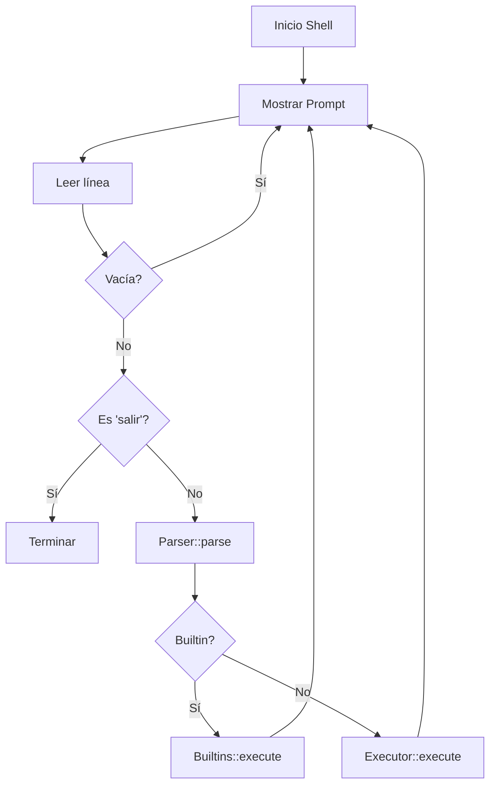

# 🐚 Minishell 
**Una implementación de shell Unix/Linux en C++**


## 🚀 Características

- **Comandos internos**: `cd`, `pwd`, `help`, `salir`
- **Comandos externos**: Ejecución de programas del sistema
- **Redirección de E/S**: `>` (salida) y `<` (entrada)
- **Procesos en segundo plano**: Soporte para `&`
- **Manejo de señales**: Control robusto de procesos

## 🛠️ Instalación

### Prerrequisitos
```bash
# Ubuntu/Debian
sudo apt install build-essential
```

### Compilación
```bash
# Clonar repositorio
git clone https://github.com/Tazuto/proyecto-SO.git
cd proyecto-SO

# Compilar
make all

# Ejecutar
./minishell
```

## 📖 Uso Básico

```bash
$ ./minishell
[minishell:~]$ help
Comandos disponibles: cd, pwd, help, salir

[minishell:~]$ pwd
/home/usuario

[minishell:~]$ cd Documents
[minishell:~/Documents]$ pwd
/home/usuario/Documents

# Redirección
[minishell:~]$ ls > archivos.txt
[minishell:~]$ cat < archivos.txt

# Proceso en background
[minishell:~]$ sleep 10 &
[Proceso en segundo plano: 1234]

[minishell:~]$ salir
```

## 📁 Estructura del Proyecto

```
proyecto-SO/
├── include/          # Headers (.hpp)
├── src/             # Código fuente (.cpp)
├── Makefile         # Sistema de build
└── README.md        # Documentación
```

### 🔄 Flujo de Ejecución



### 🧩 Componentes Principales

#### 🔧 Shell 
```cpp
class Shell {
    void run();                    // Loop principal
    void handleCommand();          // Procesar comando
    void showPrompt();            // Mostrar prompt
};
```

#### 📝 Parser
```cpp
struct Command {
    vector<string> argv;          // Argumentos
    bool background;              // Proceso en background
    string outputFile;            // Redirección salida
    string inputFile;             // Redirección entrada
};
```

#### ⚡ Executor
```cpp
class Executor {
    static void execute(Command&); // Ejecutar comando externo
private:
    static void setupRedirection(); // Configurar I/O
    static void handleBackground(); // Manejar procesos background
};
```

---
## Limitaciones conocidas
- Sin tuberías (|), redirecciones múltiples, ni encadenamiento con `;` salvo dentro de `parallel`
- Sin comillas ni escape de espacios
- Sin variables de entorno/expansión
- Sin control de jobs (fg/bg), solo background básico con PID visible
- ## Desarrollo
- Formato: C++11, estructura simple por módulos
- Tareas futuras sugeridas: soportar pipes, comillas y expansión; añadir tests; mejorar manejo de señales


